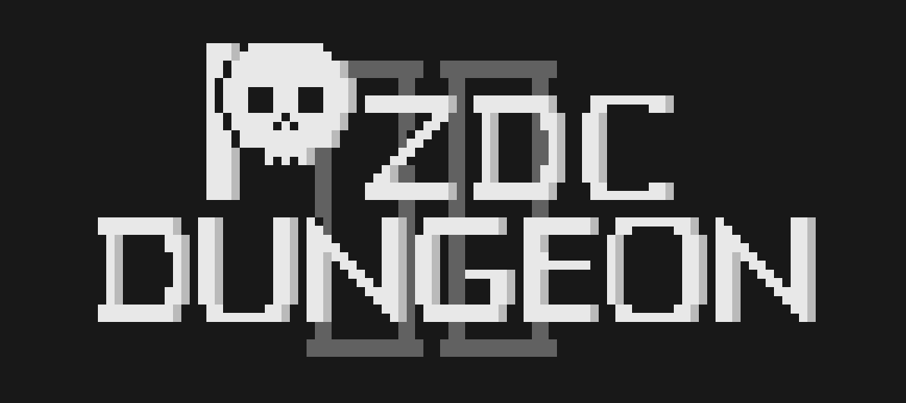
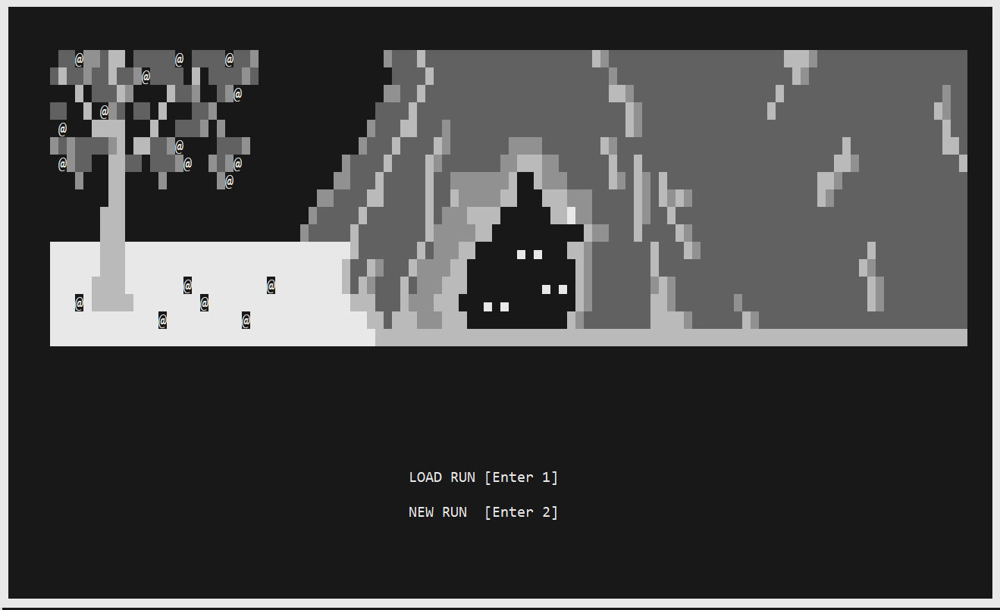
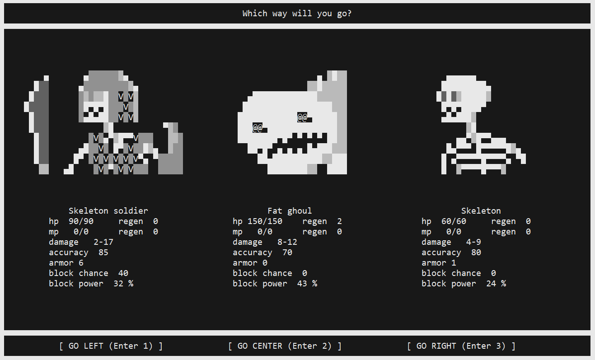
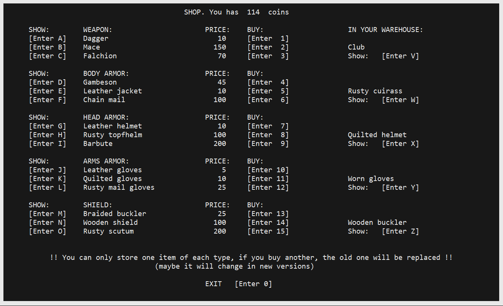
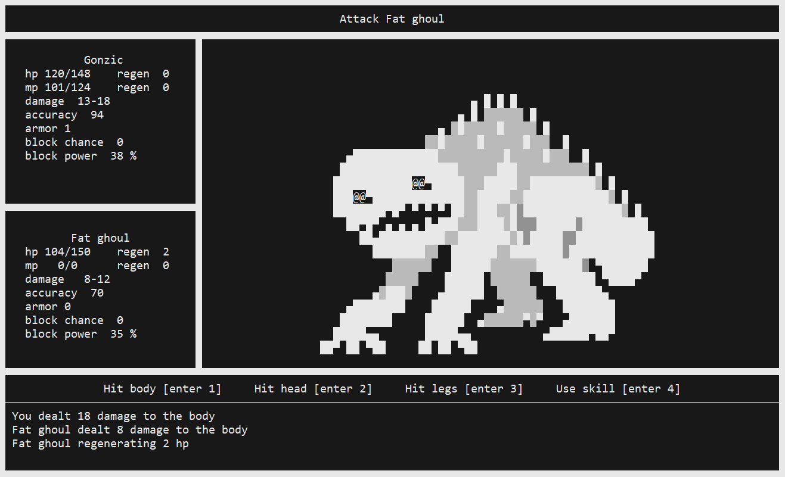
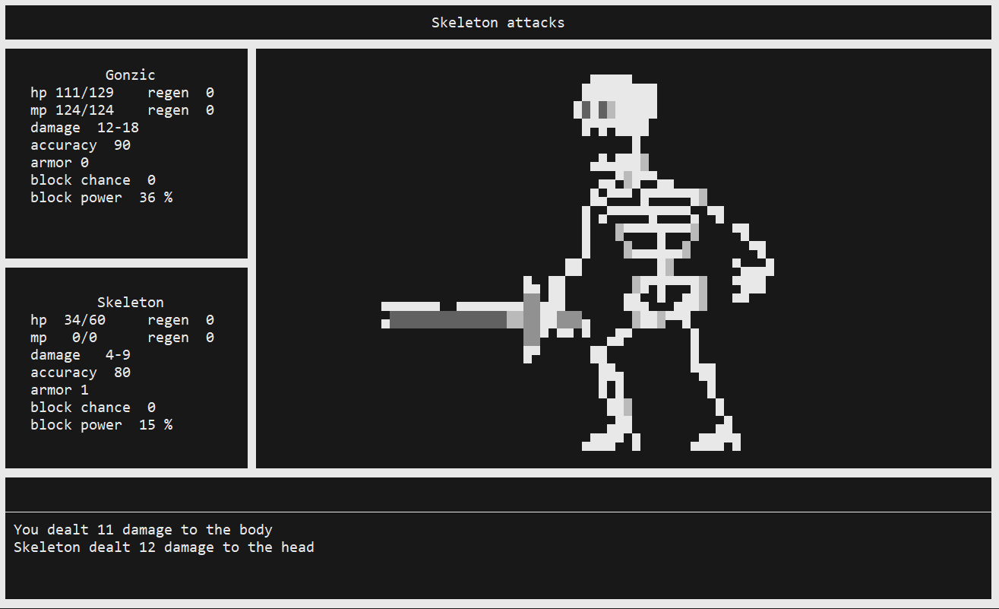
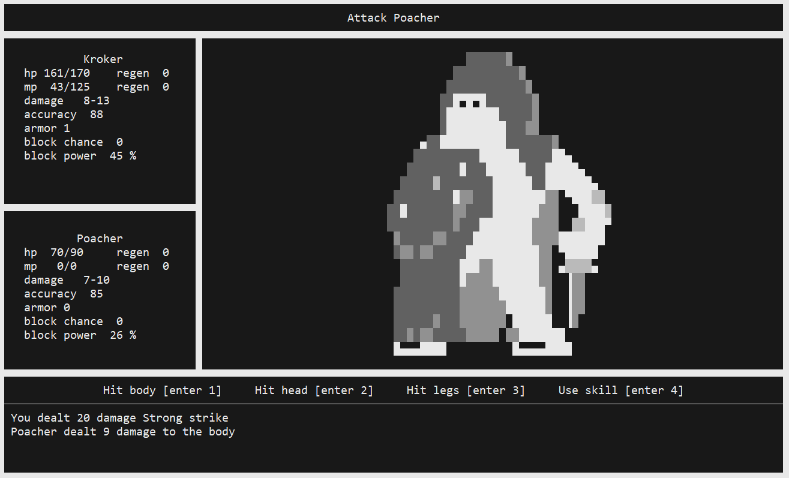
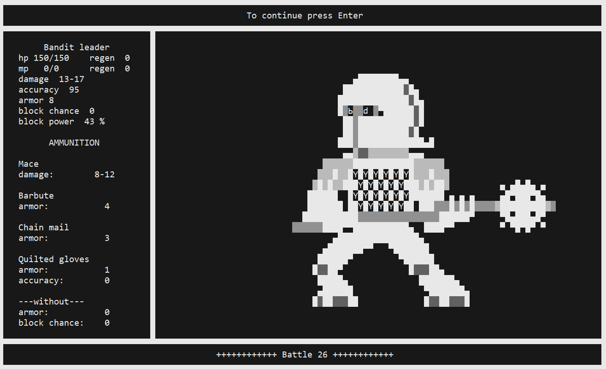

## What is it?

"PZDC dungeon 2" is a terminal based roguelike game

## Installation

```shell
git clone https://github.com/krillan49/Pzdc_dungeon2.git
```

## Requirements

The only requirement for "PZDC dungeon 2" is a local installation of Ruby 3.0.0+.

## Run

```shell
ruby pzdc_dungeon_2.rb
```

## Terminal settings

For a better picture, make the terminal window to the outline of the game screen and one line below it for input

Recommended terminal dimensions:

width  - 120

height - 36





## How to play

Create a new character, go to one of the dungeons, kill enemies, level up, earn camp bonuses. It's okay if the character dies, because the camp bonuses will be saved, distribute them so that the new character has more opportunities for a new run into the dungeon

You can also save (and exit) a dungeon run after each battle to continue it at another time. However, if you start a new run, the old one will be deleted.

If you want an easy game, then create a character named BAMBUGA then you will get a strong weapon for this run, but you will not get bonus camp points.

* Different dungeons vary in difficulty
* The battles are step-by-step, you can choose from several types of attacks
* When you get a new level, you can upgrade your characteristics and skills
* There is equipment that is knocked out of opponents
* The further you go into the dungeon, the greater the chance to meet stronger opponents





## Camp

In the camp menu you can distribute bonuses for completing or killing opponents in dungeons

* Monolith - accumulates points for killing the enemy, the stronger the enemy, the greater the chance. For monolith points in the camp, you can strengthen the characteristics of the characters
* Shop - if your character survived the previous run, then with some probability he can sell his items to the shop, and you can buy them from the merchant for new heroes
* Occult Library - Sells recipes that can be used to create living enhancements for weapons and armor from body parts of slain enemies





Characteristics and effects:
-
* Damage - depends on the equipped weapon, and can also be upgraded additionally
* Accuracy - chance to hit in %, some types of attacks are more accurate than others
* Armor - simply subtracted from the damage inflicted
* Block chance - works only if a shield is equipped, depends on the shield and the "Shield Master" skill, blocked damage - depends on current health
* Regeneration - restores hit points for each turn in battle
* Recovery - restores hit points during rest between battles
* Experience points - given for killing an enemy
* Stat points and skill points - given at the start and when leveling up

Active skills (spend mp):
-
* "Precise Strike" - greatly increases accuracy and a little damage
* "Strong Strike" - greatly increases damage

Passive skills:
-
* "Berserk" - the less hitpoints are left from the maximum, the more damage
* "Concentration" - deals additional damage when attacking depending on the maximum mp
* "Dazed" - with a certain ratio of one-time damage inflicted to the enemy's remaining hit points, you can reduce the accuracy of his next blow
* "Shield Master" - increases the chance block with a shield (the amount of damage blocked by the shield does not depend on the skill, but only on the character's current health)

Non-combat skills (work between battles):
-
* "Bloody ritual" (active) - at a halt between battles restores part of the MP, the more the greater the difference between the maximum MP and the remaining
* "First Aid" (active) - at a halt between battles restores part of the HP, the more the greater the difference between the maximum HP and the remaining
* "Treasure Hunter" (passive) - increases the chance and value of loot dropped after the battle

## TODO

* More content: dungeons, buildings, characters, enemies, equipment, skills
* More complex combat system with a greater choice of actions and their combinations
* Balancing skills, enemies, characters
* Zomby-hero add to level from dead hero
* If a large number of enemies of one type are killed, then it will be possible to play with this type of enemy
* Add translations

## SCREENS





