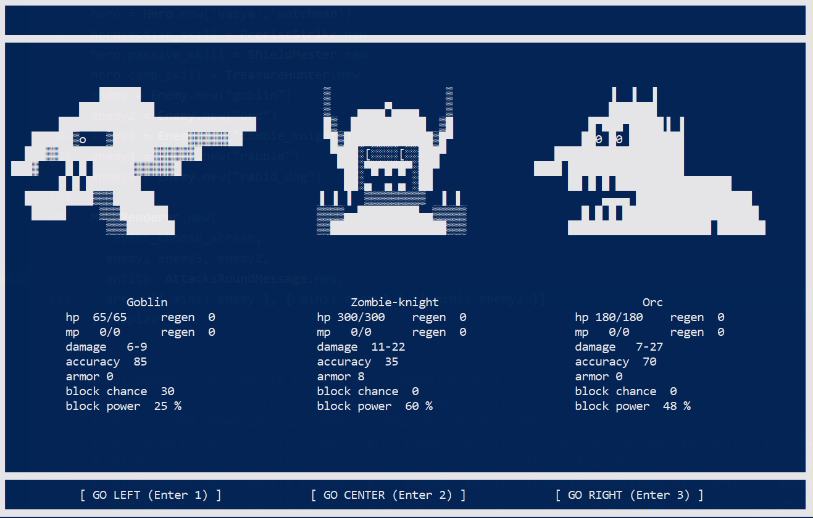

# PZDC dungeon 2



## What is it?

"PZDC dungeon 2" is a small terminal based roguelike game

[Based on "PZDC dungeon"](https://github.com/krillan49/rogulike_game_ruby)

## Installation

```shell
git clone https://github.com/krillan49/Pzdc_dungeon2.git
```

## Run

```shell
ruby pzdc_dungeon_2.rb
```

## How to play

For a better picture, make the terminal window to the outline of the game screen and one line below it for input

Create a new character, go to the dungeon, kill monsters, level up, earn camp bonuses. It's okay if the character dies, because the camp bonuses will be saved, distribute them so that the new character has more opportunities for a new run in the dungeon

You can also save (and exit) a dungeon run after each battle to continue it at another time. However, if you start a new run, the old one will be deleted.

* The battles are step-by-step, you can choose from several types of attacks
* When you get a new level, you can upgrade your characteristics and skills
* There is equipment that is knocked out of opponents
* The further you go into the dungeon, the greater the chance to meet stronger opponents
* The dungeon runs is endless for now, but you can count killing the boss "Zombie Knight" as a victory


Characteristics and effects:
-
* Damage - depends on the equipped weapon, and can also be upgraded additionally
* Accuracy - chance to hit in %, some types of attacks are more accurate than others
* Armor - simply subtracted from the damage inflicted
* Block chance - works only if a shield is equipped, depends on the shield and the "Shield Master" skill, blocked damage - depends on current health
* Regeneration - restores hit points for each turn in battle
* Recovery - restores hit points during rest between battles
* Experience points - given for killing an enemy
* Stat points and skill points - given at the start and when leveling up

Active skills (spend mp):
-
* "Precise Strike" - greatly increases accuracy and a little damage
* "Strong Strike" - greatly increases damage

Passive skills:
-
* "Concentration" - deals additional damage when attacking depending on the maximum mp
* "Shield Master" - increases the chance block with a shield (the amount of damage blocked by the shield does not depend on the skill, but only on the character's current health)
* "Dazed" - with a certain ratio of one-time damage inflicted to the enemy's remaining hit points, you can reduce the accuracy of his next blow

Non-combat skills (work between battles):
-
* "First Aid" (active) - at a halt between battles restores part of the health, the more the greater the difference between the maximum health and the remaining
* "Treasure Hunter" (passive) - increases the chance and value of loot dropped after the battle

## TODO

* Add translations
* Update camp area for distributing bonuses: viewing statistics, opening new characters, a store, etc. between battle runs
* Various locations for combat runs with enemies corresponding to their lore, for example, an undead crypt with dead people, a cave with greenskins, a bandit camp, etc.
* More content: characters, enemies, equipment, skills
* More complex combat system with a greater choice of actions and their combinations
* Balancing skills, enemies, characters
* Add documentation
* Add tests
* Zomby-hero add to level from dead hero
* If a large number of enemies of one type are killed, then it will be possible to play with this type of enemy
